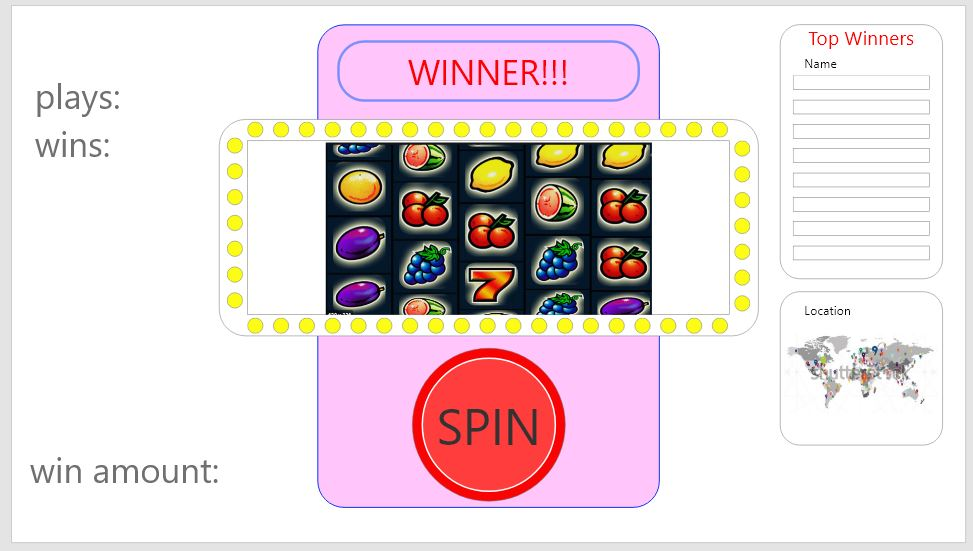
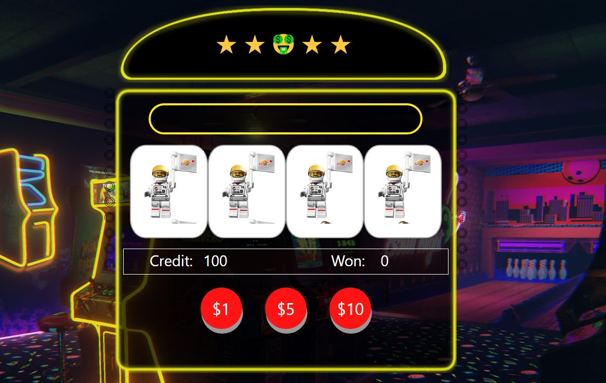

https://mikevez.github.io/Code-Institute-Milestone-2/

# :slot_machine: JavaScript Slot Machine  :slot_machine:
The aim of this project was to create a basic slot machine type game that a user could interact with by betting money and spinning the reels to try and win.
The game consists of 4 reels with various images of lego minifigures that are shuffled in a random order each time the reels are spun.

The game starts with 100 credits and three amounts can be bet (1, 5 ,10) using three buttons.

## Table of Contents
1. [**UX**](#ux)
    - [**Project Goals**](#project-goals)
    - [**User Goals**](#player-goals)
    - [**User Stories**](#user-stories)
    - [**Design Choices**](#design-choices)
    

2. [**Features**](#features)   
    - [**Existing Features**](#existing-features)
    - [**Features Left to Implement**](#features-left-to-implement)

3. [**Technologies**](#technologies)

4. [**Testing**](#testing)

5. [**Deployment**](#deployment)
    - [**How to Run Code Locally**](#how-to-run-locally)

6. [**Credits**](#credits)
    - [**Content**](#content)
    - [**Media**](#media)    
    - [**Acknowledgements**](#acknowledgements)
    
    ## UX

#### Project Goals

### User Goals

The aim of this project was to use JavaScript to make a site that a user could interact with. The final idea was to go with a basic slot machine style game that was easy for the user to use. The game contains 3 premade amounts that are assigned to buttons to the user to press.

#### User Stories

The game starts with 100 dollars that the user has to bet with. The user has a choice of three different values in which they can bet; 1, 5, or 10 dollars. The higher the amount the user bets, the higher the reward if the user wins. A win is accomplished by matching images on the spinning reels.

### Design Choices

The original design was was done with a basic sketch in photoshop and is shown below depicting a score board and map marking the highest winnings



The final build; I'm a big fan of lego so I chose lego minifigures as the slot machine pictures rather than the normal fruit type images usually associated with slot machines. I also decided to have 3 fixed betting amounts displayed on 3 buttons. The final version is displayed below.




**Buttons**

The game contains three simple buttons, each contain a value which the user can use to bet a set amount of money. ($1, $5, $10). I used CSS to add a box shadow to each button to give it a 3D type look that would reduce when clicked. This gave the impression that the button was pressed and would pop back up after being pressed by the user.

**Colours**

The colours used are all dark with bright yellow lines around objects to give the impression of a neon type glow. Feathered yellow lines were drawn in photoshop and used as some of he div backgounds to give a neon type border around the game. 


## Features left to implement 
In the future, I would like to be able to log the highest winnings and maybe a google maps API tp display the country in which the top winners are located.

## Technologies Used

- This project uses HTML, CSS and JavaScript programming languages.
- [JQuery](https://jquery.com)
    - The project uses **JQuery** to simplify DOM manipulation. JQuery was used to quick alter the Y position of the reel pictures to give the impresson of spinning reels upon clicking one of the buttons.

- [Bootstrap](https://www.bootstrapcdn.com/)
    - The project uses **Bootstrap** to simplify the structure of the website and make the website responsive easily to different size screens.
    

- [GitHub](https://github.com/)
    - This project uses **GitHub** to store and share all project code remotely. 


   ## Deployment

The site was assembled and coded within Google Chrome browser using GitPod and then uploaded to GitHub using GitPod through the command line using 'add, commit, push' commands.

### How to Run Code Locally
In order to run a repository locally, the repository must be cloned. To clone the repository
:
1. Follow the link to the [interactive front end development project GitHub repository](https://github.com/...........................).
2. Under the repository name, click "Clone or download".
3. In the Clone with HTTPs section, copy the clone URL for the repository. 
4. In your preferred IDE, open the terminal.
5. Change the current working directory to the location where you want the cloned directory to be made.
6. Type ```git clone```, and then paste the URL you copied in Step 3.
```console
git clone https://github.com/USERNAME/REPOSITORY
```
7. Press Enter. Your local clone will be created.

Further reading and troubleshooting on how to clone a repository from GitHub may be found [here](https://help.github.com/en/articles/cloning-a-repository).

### Testing

### Validation services
The following validation services and linter were used to check the validity of the website code.
- [W3C Markup Validation]( https://validator.w3.org/) was used to validate HTML.
- [W3C CSS validation](https://jigsaw.w3.org/css-validator/) was used to validate CSS.
- [JSHint](https://jshint.com/) was used to validate JavaScript.

## Manual testing
Below is a detailed account of all the manual testing that has been done to confirm all areas of the site work as expected. 

### Testing undertaken on desktop and laptop

All steps on desktop were repeated in browsers: Firefox, Chrome and Internet Explorer and on two different desktop screen sizes.

1. Responsiveness
    - The results table sits alongside the map on larger devices as PC and laptop. 

### Testing undertaken on tablet and phone devices
All steps below were repeated to test mobile specific elements on the developers 2 Samsung phones and tablet. 
And also in the Chrome Developer Tools device simulators on all options and orientations.

1. Responsiveness
    - The results table is hidden and appears directly under the map only when the user selects the visit, stay or dine buttons.

This site was tested across multiple browsers (Chrome, Safari, Internet Explorer, FireFox) in Google Dev tools(Galaxy S5, Pixel 2/Pixel 2 XL, iphone 5/SE/6/7/8 Plus, X, ipad and ipad Pro) and on multiple devices.

## Further Testing

Family and friends were asked to try the app on their devices. This insight was invaluable for improving site usability. 

### Content 

- All Content and Code was written by me.


### Media

The casino background image media was obtained through Unsplash [unsplash.com](https://unsplash.com/)

### Acknowledgements

Thank you for the guidance provided by Slack and my mentor 
Maranatha A. Ilesanmi for all his help!

